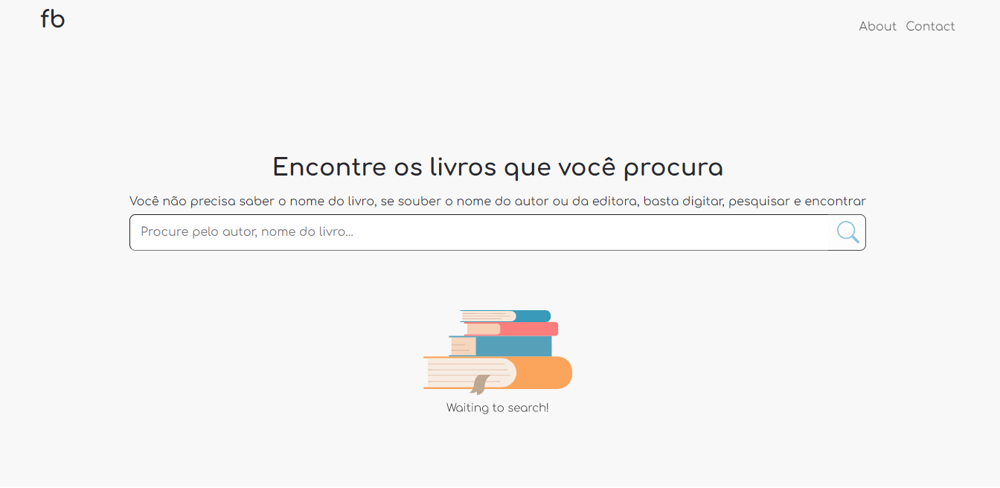

<p align="center">
  
</p>

<br>

## 📚 Find-books

Find the books you want by searching on Find-books, you don't need to know the name of the book, if you know the author or publisher name, just type, search and find.

## 🧪 Technologies

This project was developed using the following technologies:

- [React](https://reactjs.org)
- [TypeScript](https://www.typescriptlang.org/)
- [CSS](https://developer.mozilla.org/pt-BR/docs/Web/CSS)
- [HTML](https://developer.mozilla.org/pt-BR/docs/Web/HTML)

## 🚀 Getting started

Clone the project and access the folder.

```bash
$ git clone https://github.com/davysz/find-books.git
$ cd find-books
```

Follow the steps below:

```bash
# Install the dependencies
$ yarn

# Start the project
$ yarn start
```

Create and configure environment variables
```
REACT_APP_OPEN_API_KEY=
```

The app will be available for access on your browser at http://localhost:3000

---

<p align="center">Made with 💜 by Davy de Souza</p>
